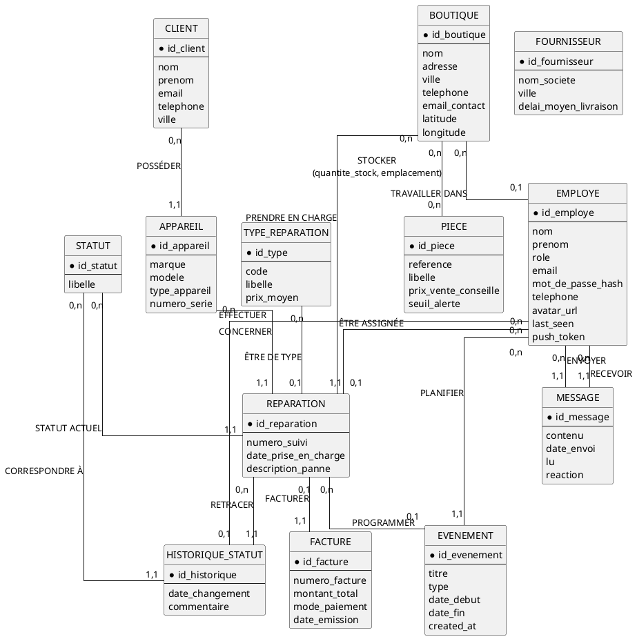
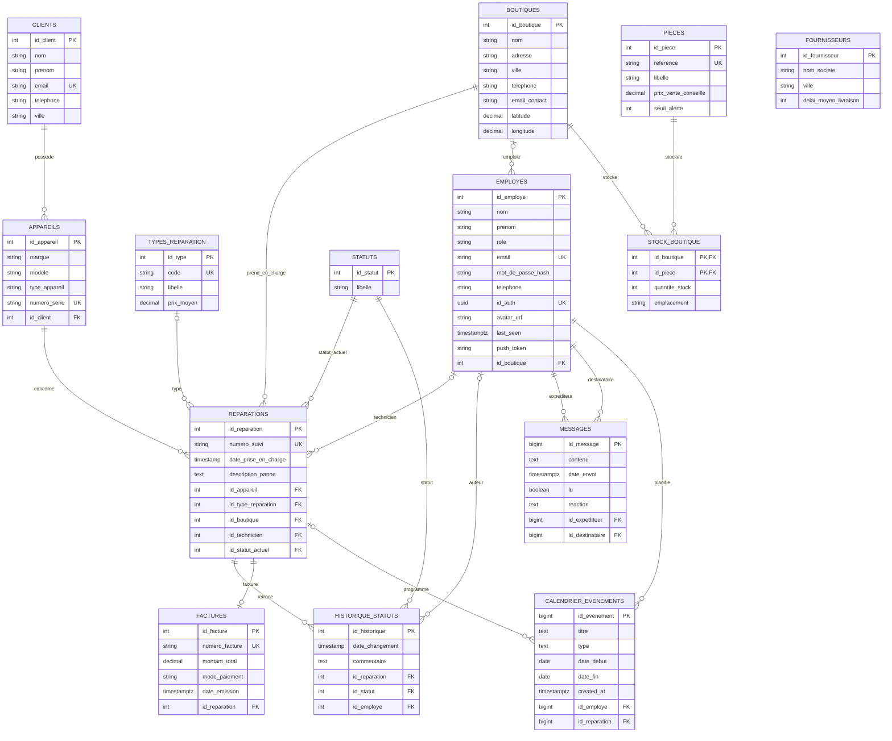
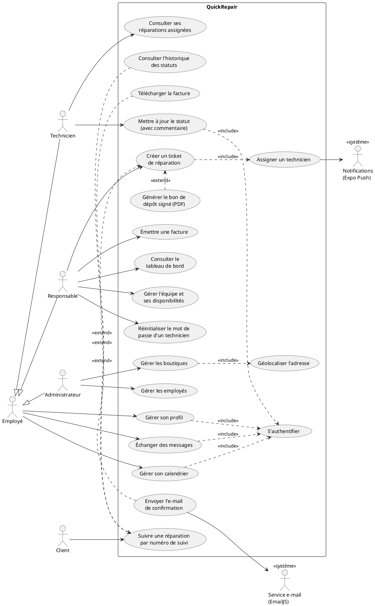

# QuickRepair — Dossier de conception (MCD, MLD, cas d'utilisation)

> Document établi à partir de la base de données réelle (Supabase / PostgreSQL, schéma `public`, 14 tables) et du code de l'application (front React, serveur NestJS, application mobile Expo).
> Les schémas sont fournis en code **PlantUML** et **Mermaid** pour être transformés en images (voir la section 6).

---

## 1. Présentation du système

QuickRepair est une application de gestion d'un réseau de boutiques de réparation d'appareils (smartphones, ordinateurs, tablettes…). Elle couvre :

- la **prise en charge** d'un appareil en boutique (client, appareil, panne, technicien assigné, bon de dépôt signé) ;
- le **suivi de la réparation** par statuts successifs, avec historique ;
- la **facturation** et la clôture du dossier ;
- le **suivi en ligne par le client** grâce à un numéro de suivi ;
- la **gestion des boutiques et des employés** ;
- la **communication interne** (messagerie temps réel, présence en ligne, notifications) ;
- la **planification** (calendrier des interventions, congés, formations, réunions).

Architecture : application web (React + Vite), application mobile (React Native / Expo), API REST + WebSocket (NestJS + Prisma), base PostgreSQL et authentification hébergées sur Supabase.

---

## 2. Règles de gestion

| N° | Règle |
|---|---|
| RG1 | Un client peut posséder plusieurs appareils ; un appareil appartient à un seul client. |
| RG2 | Un appareil peut faire l'objet de plusieurs réparations au fil du temps ; une réparation concerne un seul appareil. |
| RG3 | Une réparation est identifiée publiquement par un **numéro de suivi unique**, communiqué au client. |
| RG4 | Une réparation est prise en charge par une seule boutique ; une boutique traite plusieurs réparations. |
| RG5 | Une réparation est assignée à au plus un technicien ; un technicien peut avoir plusieurs réparations. |
| RG6 | Une réparation peut être rattachée à un type de réparation (catalogue avec prix moyen). |
| RG7 | Une réparation a, à tout instant, un seul **statut actuel** parmi : Déposé, Diagnostic, Devis envoyé, En attente pièce, En cours, Terminée, Prête, Livrée, Annulée. |
| RG8 | Chaque changement de statut est **historisé** (date, statut, employé auteur, commentaire). |
| RG9 | Une réparation donne lieu à au plus une facture ; l'émission de la facture fait passer la réparation au statut « Livrée ». |
| RG10 | Une facture possède un numéro unique, un montant total et un mode de paiement. |
| RG11 | Un employé a un seul rôle : Administrateur, Responsable (manager) ou Technicien. |
| RG12 | Un responsable ou un technicien est rattaché à une seule boutique ; un administrateur n'est rattaché à aucune boutique. |
| RG13 | Un technicien ne peut modifier le statut que des réparations qui lui sont assignées. |
| RG14 | Seul un responsable peut créer une réparation et émettre une facture ; seul un administrateur peut créer une boutique. |
| RG15 | Un message est envoyé par un employé à un autre employé ; il peut être marqué « lu » et recevoir une réaction. |
| RG16 | Un événement de calendrier (réparation, congé, formation, réunion, autre) concerne un seul employé et peut être lié à une réparation. |
| RG17 | Une boutique stocke des pièces détachées en certaine quantité, à un emplacement donné. |
| RG18 | Les fournisseurs sont référencés avec leur délai moyen de livraison. |

---

## 3. Modèle Conceptuel de Données (MCD)

### 3.1 Dictionnaire des entités

| Entité | Identifiant | Propriétés |
|---|---|---|
| CLIENT | id_client | nom, prenom, email, telephone, ville |
| APPAREIL | id_appareil | marque, modele, type_appareil, numero_serie |
| REPARATION | id_reparation | numero_suivi, date_prise_en_charge, description_panne |
| TYPE_REPARATION | id_type | code, libelle, prix_moyen |
| STATUT | id_statut | libelle |
| HISTORIQUE_STATUT | id_historique | date_changement, commentaire |
| FACTURE | id_facture | numero_facture, montant_total, mode_paiement, date_emission |
| BOUTIQUE | id_boutique | nom, adresse, ville, telephone, email_contact, latitude, longitude |
| EMPLOYE | id_employe | nom, prenom, role, email, mot_de_passe_hash, telephone, avatar_url, last_seen, push_token |
| MESSAGE | id_message | contenu, date_envoi, lu, reaction |
| EVENEMENT | id_evenement | titre, type, date_debut, date_fin, created_at |
| PIECE | id_piece | reference, libelle, prix_vente_conseille, seuil_alerte |
| FOURNISSEUR | id_fournisseur | nom_societe, ville, delai_moyen_livraison |

> `HISTORIQUE_STATUT` est modélisée comme une entité (et non comme une association ternaire), car un même employé peut attribuer plusieurs fois le même statut à une même réparation : le triplet (réparation, statut, employé) ne suffit pas à l'identifier.

### 3.2 Associations et cardinalités

| Association | Entité A | Card. A | Card. B | Entité B | Propriétés |
|---|---|---|---|---|---|
| POSSÉDER | CLIENT | 0,n | 1,1 | APPAREIL | |
| CONCERNER | APPAREIL | 0,n | 1,1 | REPARATION | |
| ÊTRE DE TYPE | TYPE_REPARATION | 0,n | 0,1 | REPARATION | |
| PRENDRE EN CHARGE | BOUTIQUE | 0,n | 1,1 | REPARATION | |
| ÊTRE ASSIGNÉE | EMPLOYE (technicien) | 0,n | 0,1 | REPARATION | |
| AVOIR POUR STATUT ACTUEL | STATUT | 0,n | 1,1 | REPARATION | |
| RETRACER | REPARATION | 0,n | 1,1 | HISTORIQUE_STATUT | |
| CORRESPONDRE À | STATUT | 0,n | 1,1 | HISTORIQUE_STATUT | |
| EFFECTUER | EMPLOYE | 0,n | 0,1 | HISTORIQUE_STATUT | |
| FACTURER | REPARATION | 0,1 | 1,1 | FACTURE | |
| TRAVAILLER DANS | BOUTIQUE | 0,n | 0,1 | EMPLOYE | |
| ENVOYER | EMPLOYE (expéditeur) | 0,n | 1,1 | MESSAGE | |
| RECEVOIR | EMPLOYE (destinataire) | 0,n | 1,1 | MESSAGE | |
| PLANIFIER | EMPLOYE | 0,n | 1,1 | EVENEMENT | |
| PROGRAMMER | REPARATION | 0,n | 0,1 | EVENEMENT | |
| STOCKER | BOUTIQUE | 0,n | 0,n | PIECE | quantite_stock, emplacement |

> Lecture : « Un CLIENT possède **0 à n** APPAREILS ; un APPAREIL est possédé par **1 et 1 seul** CLIENT. »
> `FOURNISSEUR` n'est relié à aucune autre entité dans la base actuelle (voir 3.4).

### 3.3 Schéma du MCD (PlantUML)

> Pour un MCD au formalisme Merise « pur » (ovales pour les associations), saisir les entités et associations ci-dessus dans **Looping** (logiciel gratuit, https://www.looping-mcd.fr), qui génère aussi le MLD automatiquement.

### 3.4 Remarques à valoriser dans le mémoire

- **Écart conceptuel / physique** : en base, plusieurs clés étrangères sont facultatives (`appareils.id_client`, `reparations.id_appareil`, `reparations.id_boutique`, `reparations.id_statut_actuel`) alors que les règles de gestion les rendent obligatoires ; l'application garantit leur présence. Rendre ces colonnes `NOT NULL` serait une amélioration.
- **RG9** : la base n'impose pas d'unicité de `factures.id_reparation` ; la règle « une facture par réparation » est assurée par l'application. Une contrainte `UNIQUE` la garantirait.
- **Stock et fournisseurs** (`PIECE`, `STOCKER`, `FOURNISSEUR`) : présents dans la base mais **pas encore exploités** par l'application → perspective d'évolution (gestion des stocks, alerte sous le `seuil_alerte`, commandes fournisseurs). Une association « FOURNIR » entre FOURNISSEUR et PIECE serait à ajouter.
- **Historisation automatique** : un *trigger* PostgreSQL crée une ligne dans `historique_statuts` à chaque changement de `id_statut_actuel` ; l'application y ajoute ensuite le commentaire du technicien.
- **Authentification** : `employes.id_auth` relie l'employé à son compte Supabase Auth (schéma `auth`, géré par Supabase).

---

## 4. Modèle Logique de Données (MLD)

### 4.1 Règles de passage appliquées

1. Chaque entité devient une **table** ; son identifiant devient la **clé primaire**.
2. Association **(0,n)–(1,1)** ou **(0,n)–(0,1)** : la clé primaire du côté « n » migre comme **clé étrangère** dans la table du côté « 1 ».
3. Association **(0,n)–(0,n)** : création d'une **table de jonction** dont la clé primaire est composée des deux clés étrangères (ici `STOCK_BOUTIQUE`).
4. Association **(0,1)–(1,1)** (FACTURER) : la clé migre dans la table du côté (1,1), `FACTURE`.

### 4.2 Schéma relationnel (notation textuelle)

Convention : **clé primaire en gras**, `#` = clé étrangère.

- CLIENTS (**id_client**, nom, prenom, email, telephone, ville)
- APPAREILS (**id_appareil**, marque, modele, type_appareil, numero_serie, #id_client)
- BOUTIQUES (**id_boutique**, nom, adresse, ville, telephone, email_contact, latitude, longitude)
- EMPLOYES (**id_employe**, nom, prenom, role, email, mot_de_passe_hash, telephone, id_auth, avatar_url, last_seen, push_token, #id_boutique)
- TYPES_REPARATION (**id_type**, code, libelle, prix_moyen)
- STATUTS (**id_statut**, libelle)
- REPARATIONS (**id_reparation**, numero_suivi, date_prise_en_charge, description_panne, #id_appareil, #id_type_reparation, #id_boutique, #id_technicien, #id_statut_actuel)
- HISTORIQUE_STATUTS (**id_historique**, date_changement, commentaire, #id_reparation, #id_statut, #id_employe)
- FACTURES (**id_facture**, numero_facture, montant_total, mode_paiement, date_emission, #id_reparation)
- MESSAGES (**id_message**, contenu, date_envoi, lu, reaction, #id_expediteur, #id_destinataire)
- CALENDRIER_EVENEMENTS (**id_evenement**, titre, type, date_debut, date_fin, created_at, #id_employe, #id_reparation)
- PIECES (**id_piece**, reference, libelle, prix_vente_conseille, seuil_alerte)
- STOCK_BOUTIQUE (**#id_boutique, #id_piece**, quantite_stock, emplacement)
- FOURNISSEURS (**id_fournisseur**, nom_societe, ville, delai_moyen_livraison)

Précisions :
- `REPARATIONS.id_technicien` référence `EMPLOYES.id_employe`.
- `MESSAGES.id_expediteur` et `MESSAGES.id_destinataire` référencent tous deux `EMPLOYES.id_employe`.

### 4.3 Contraintes d'intégrité

| Table | Contrainte |
|---|---|
| CLIENTS | `email` unique |
| APPAREILS | `numero_serie` unique ; suppression du client ⇒ suppression de ses appareils (`ON DELETE CASCADE`) |
| EMPLOYES | `email` unique ; `id_auth` unique |
| REPARATIONS | `numero_suivi` unique |
| HISTORIQUE_STATUTS | suppression de la réparation ⇒ suppression de son historique (`CASCADE`) |
| FACTURES | `numero_facture` unique (format `FAC-AAAA-NNNN`) ; suppression de la réparation ⇒ suppression de la facture (`CASCADE`) |
| PIECES | `reference` unique ; `seuil_alerte` = 5 par défaut |
| STOCK_BOUTIQUE | clé primaire composée (`id_boutique`, `id_piece`) ; `quantite_stock` = 0 par défaut |
| MESSAGES | `lu` = faux par défaut ; index sur expéditeur et destinataire |
| CALENDRIER_EVENEMENTS | `type` ∈ {reparation, conge, formation, reunion, autre}, « autre » par défaut ; index sur (`date_debut`, `date_fin`) et sur `id_employe` |

### 4.4 Dictionnaire de données (types PostgreSQL)

| Table | Colonne | Type | Null | Remarque |
|---|---|---|---|---|
| clients | id_client | serial | non | PK |
| | nom / prenom | varchar(100) | non | |
| | email | varchar(255) | oui | unique |
| | telephone | varchar(20) | oui | |
| | ville | varchar(100) | oui | |
| appareils | id_appareil | serial | non | PK |
| | marque | varchar(50) | oui | |
| | modele | varchar(100) | oui | |
| | type_appareil | varchar(50) | oui | |
| | numero_serie | varchar(100) | oui | unique |
| | id_client | integer | oui | FK → clients |
| boutiques | id_boutique | serial | non | PK |
| | nom | varchar(100) | non | |
| | adresse | varchar(255) | oui | |
| | ville | varchar(100) | oui | |
| | telephone | varchar(20) | oui | |
| | email_contact | varchar(100) | oui | |
| | latitude / longitude | decimal(10,8) / decimal(11,8) | oui | géolocalisation (carte) |
| employes | id_employe | serial | non | PK |
| | nom / prenom | varchar(100) | non | |
| | role | varchar(50) | non | Administrateur, Responsable, Technicien |
| | email | varchar(255) | oui | unique |
| | mot_de_passe_hash | varchar(255) | oui | hash bcrypt |
| | telephone | varchar(20) | oui | |
| | id_auth | uuid | oui | unique, lien Supabase Auth |
| | avatar_url | text | oui | photo de profil |
| | last_seen | timestamptz | oui | dernière présence |
| | push_token | text | oui | notifications mobiles |
| | id_boutique | integer | oui | FK → boutiques |
| types_reparation | id_type | serial | non | PK |
| | code | varchar(20) | oui | unique |
| | libelle | varchar(100) | non | |
| | prix_moyen | decimal(10,2) | oui | |
| statuts | id_statut | serial | non | PK |
| | libelle | varchar(50) | non | |
| reparations | id_reparation | serial | non | PK |
| | numero_suivi | varchar(50) | non | unique |
| | date_prise_en_charge | timestamp | oui | défaut : maintenant |
| | description_panne | text | oui | |
| | id_appareil | integer | oui | FK → appareils |
| | id_type_reparation | integer | oui | FK → types_reparation |
| | id_boutique | integer | oui | FK → boutiques |
| | id_technicien | integer | oui | FK → employes |
| | id_statut_actuel | integer | oui | FK → statuts |
| historique_statuts | id_historique | serial | non | PK |
| | date_changement | timestamp | oui | défaut : maintenant |
| | commentaire | text | oui | |
| | id_reparation | integer | oui | FK → reparations |
| | id_statut | integer | oui | FK → statuts |
| | id_employe | integer | oui | FK → employes |
| factures | id_facture | serial | non | PK |
| | numero_facture | varchar(20) | non | unique |
| | montant_total | decimal(10,2) | non | |
| | mode_paiement | varchar(50) | non | |
| | date_emission | timestamptz | oui | défaut : maintenant |
| | id_reparation | integer | oui | FK → reparations |
| messages | id_message | bigserial | non | PK |
| | contenu | text | non | |
| | date_envoi | timestamptz | non | défaut : maintenant |
| | lu | boolean | non | défaut : faux |
| | reaction | text | oui | emoji |
| | id_expediteur | bigint | non | FK → employes |
| | id_destinataire | bigint | non | FK → employes |
| calendrier_evenements | id_evenement | bigserial | non | PK |
| | titre | text | non | |
| | type | text | non | défaut : autre |
| | date_debut / date_fin | date | non | |
| | created_at | timestamptz | non | défaut : maintenant |
| | id_employe | bigint | non | FK → employes |
| | id_reparation | bigint | oui | FK → reparations |
| pieces | id_piece | serial | non | PK |
| | reference | varchar(50) | non | unique |
| | libelle | varchar(100) | non | |
| | prix_vente_conseille | decimal(10,2) | oui | |
| | seuil_alerte | integer | oui | défaut : 5 |
| stock_boutique | id_boutique | integer | non | PK, FK → boutiques |
| | id_piece | integer | non | PK, FK → pieces |
| | quantite_stock | integer | oui | défaut : 0 |
| | emplacement | varchar(50) | oui | |
| fournisseurs | id_fournisseur | serial | non | PK |
| | nom_societe | varchar(100) | non | |
| | ville | varchar(100) | oui | |
| | delai_moyen_livraison | integer | oui | en jours |

### 4.5 Schéma du MLD (Mermaid)

---

## 5. Cas d'utilisation

### 5.1 Acteurs

| Acteur | Type | Description |
|---|---|---|
| Client | principal, non authentifié | Propriétaire de l'appareil ; suit sa réparation avec son numéro de suivi. |
| Employé | principal, abstrait | Généralisation des trois rôles internes ; regroupe les fonctions communes. |
| Technicien | principal | Réalise les réparations qui lui sont assignées. |
| Responsable | principal | Manager d'une boutique : accueil client, assignation, équipe, facturation. |
| Administrateur | principal | Gère le réseau : boutiques et comptes employés. |
| Service e-mail (EmailJS) | secondaire | Envoie l'e-mail de confirmation de dépôt au client. |
| Service de notifications (Expo Push) | secondaire | Envoie les notifications push sur mobile. |
| Supabase | secondaire | Authentification, base de données, temps réel, stockage des avatars. |

Hiérarchie : **Technicien**, **Responsable** et **Administrateur** héritent d'**Employé**.

### 5.2 Liste des cas d'utilisation

| Acteur | Cas d'utilisation | Web | Mobile |
|---|---|---|---|
| **Client** | Suivre une réparation par numéro de suivi | ✔ | |
| | Consulter l'historique des statuts de sa réparation | ✔ | |
| | Télécharger sa facture (PDF) | ✔ | |
| **Employé** (tous rôles) | S'authentifier | ✔ | ✔ |
| | Gérer son profil (photo, informations, mot de passe) | ✔ | ✔ |
| | Échanger des messages en temps réel (indicateur de saisie, réactions, non-lus) | ✔ | ✔ |
| | Voir la présence en ligne des collègues | ✔ | ✔ |
| | Consulter son calendrier / ses disponibilités | ✔ | ✔ |
| | Gérer ses événements de calendrier (congé, formation, réunion…) | ✔ | ✔ |
| | Recevoir des notifications | ✔ | ✔ (push) |
| **Technicien** | Consulter les réparations qui lui sont assignées | ✔ | ✔ |
| | Mettre à jour le statut d'une réparation avec commentaire | ✔ | ✔ |
| | Consulter l'historique d'une réparation | ✔ | ✔ |
| | Être notifié en temps réel d'une nouvelle assignation | ✔ | ✔ |
| **Responsable** | Créer un ticket de réparation (client, appareil, panne, technicien) | ✔ | ✔ |
| | Générer le bon de dépôt PDF signé par le client | ✔ | |
| | Envoyer l'e-mail de confirmation au client | ✔ | |
| | Consulter les réparations de sa boutique et leur historique | ✔ | ✔ |
| | Émettre une facture (montant, mode de paiement) | ✔ | ✔ |
| | Consulter le tableau de bord (statistiques, graphiques) | ✔ | |
| | Gérer son équipe (fiches techniciens, disponibilités) | ✔ | ✔ |
| | Planifier des événements pour toute l'équipe (y compris récurrents) | ✔ | ✔ |
| | Réinitialiser le mot de passe d'un technicien | ✔ | |
| **Administrateur** | Créer une boutique (avec géolocalisation de l'adresse sur carte) | ✔ | ✔ |
| | Consulter les boutiques et leur équipe | ✔ | ✔ |
| | Créer un compte employé (Responsable ou Technicien) | ✔ | ✔ |
| | Consulter la fiche d'un employé | ✔ | ✔ |

### 5.3 Diagramme de cas d'utilisation (PlantUML)

### 5.4 Descriptions textuelles des cas principaux

#### CU1 — Créer un ticket de réparation
| Rubrique | Contenu |
|---|---|
| Acteur principal | Responsable |
| Acteurs secondaires | Technicien (notifié), Service e-mail, Service de notifications |
| Préconditions | Le responsable est authentifié et rattaché à une boutique. |
| Postconditions | Client (créé ou mis à jour), appareil et réparation enregistrés ; numéro de suivi généré ; statut « Déposé » historisé ; technicien notifié ; événement ajouté à son calendrier. |
| Scénario nominal | 1. Le responsable ouvre le formulaire de nouveau ticket. 2. Il saisit les informations du client (nom, prénom, e-mail, téléphone). 3. Il saisit l'appareil (marque, modèle, type, n° de série) et la description de la panne. 4. Il choisit un technicien de sa boutique (disponibilités affichées). 5. Le client signe le bon de dépôt. 6. Le système enregistre client, appareil et réparation en une seule transaction et génère un numéro de suivi unique. 7. Le système notifie le technicien en temps réel (WebSocket / push). 8. Le système génère le bon de dépôt PDF et envoie l'e-mail de confirmation au client. |
| Alternatives | 2a. Le client existe déjà (même e-mail) : ses informations sont mises à jour au lieu d'être recréées. 8a. Pas d'e-mail client : aucune confirmation n'est envoyée. |
| Exceptions | 6a. Données invalides : le système refuse l'enregistrement et affiche les erreurs. 6b. Rôle non autorisé : accès refusé (403). |

#### CU2 — Mettre à jour le statut d'une réparation
| Rubrique | Contenu |
|---|---|
| Acteur principal | Technicien (ou Responsable) |
| Préconditions | L'acteur est authentifié ; pour un technicien, la réparation lui est assignée. |
| Postconditions | Nouveau statut actuel enregistré ; ligne d'historique créée (date, statut, auteur, commentaire). |
| Scénario nominal | 1. Le technicien ouvre une réparation de sa liste. 2. Il choisit le nouveau statut (Diagnostic, Devis envoyé, En attente pièce, En cours, Terminée, Prête…). 3. Il saisit éventuellement un commentaire. 4. Le système met à jour le statut ; un trigger PostgreSQL historise le changement, puis le commentaire y est ajouté. 5. Le client voit le nouveau statut sur la page de suivi. |
| Exceptions | 1a. Réparation inexistante : erreur 404. 1b. Réparation assignée à un autre technicien : accès refusé (403). |

#### CU3 — Émettre une facture
| Rubrique | Contenu |
|---|---|
| Acteur principal | Responsable |
| Préconditions | Responsable authentifié ; réparation existante (en pratique « Terminée » ou « Prête »). |
| Postconditions | Facture enregistrée avec un numéro unique `FAC-AAAA-NNNN` ; réparation passée au statut « Livrée ». |
| Scénario nominal | 1. Le responsable ouvre la réparation et choisit « Facturer ». 2. Il saisit le montant total et le mode de paiement. 3. Le système crée la facture et passe la réparation au statut « Livrée » dans une même transaction. 4. La facture devient téléchargeable par le client. |
| Exceptions | 3a. Réparation introuvable : erreur 404. 3b. Montant invalide : erreur de validation (400). |

#### CU4 — Suivre une réparation (client)
| Rubrique | Contenu |
|---|---|
| Acteur principal | Client |
| Préconditions | Le client dispose de son numéro de suivi (bon de dépôt ou e-mail). |
| Postconditions | Aucune modification des données. |
| Scénario nominal | 1. Le client ouvre la page publique de suivi. 2. Il saisit son numéro de suivi (insensible à la casse). 3. Le système affiche l'appareil, le statut actuel et l'historique des étapes. 4. Si une facture existe, il peut la télécharger en PDF. |
| Exceptions | 3a. Numéro inconnu : message « Aucune réparation trouvée pour ce numéro de suivi ». |

#### CU5 — S'authentifier
| Rubrique | Contenu |
|---|---|
| Acteur principal | Employé |
| Scénario nominal | 1. L'employé saisit son e-mail et son mot de passe. 2. Le système vérifie les identifiants (mot de passe haché bcrypt) et délivre un jeton JWT (valable 24 h). 3. L'employé est redirigé vers le tableau de bord de son rôle. |
| Exceptions | 2a. Identifiants incorrects : erreur 401 « Identifiants incorrects ». 2b. Format invalide : erreur 400. 3a. Accès à une page d'un autre rôle : redirection. |

#### CU6 — Gérer les boutiques
| Rubrique | Contenu |
|---|---|
| Acteur principal | Administrateur |
| Postconditions | Boutique enregistrée avec ses coordonnées GPS. |
| Scénario nominal | 1. L'administrateur saisit nom, adresse, ville, téléphone, e-mail. 2. Le système géocode l'adresse (latitude, longitude) et l'affiche sur la carte. 3. L'administrateur valide ; la boutique apparaît dans la liste et sur la carte. 4. Il peut ensuite consulter l'équipe de la boutique et y créer des comptes employés. |
| Exceptions | 3a. Utilisateur non administrateur : accès refusé (403). |

---

## 6. Transformer les schémas en images pour le mémoire

| Schéma | Outil | Démarche |
|---|---|---|
| MCD (Merise) | **Looping** (gratuit) — https://www.looping-mcd.fr | Saisir entités/associations du §3 ; export image ; génère aussi le MLD et le SQL. |
| MCD / cas d'utilisation (PlantUML) | https://www.plantuml.com/plantuml ou extension VS Code « PlantUML » | Coller le bloc `@startuml … @enduml` ; export PNG/SVG. |
| MLD (Mermaid) | https://mermaid.live ou aperçu Markdown de VS Code / GitHub | Coller le bloc `erDiagram` ; export PNG/SVG. |
